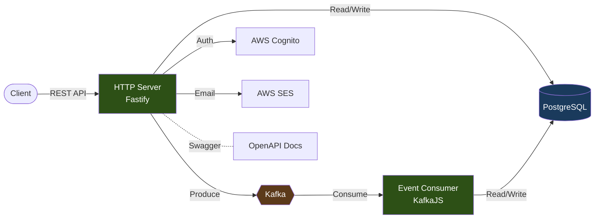

# DDD subscription-management-service

Backend service containing Subscription, Account, User, Authentication and related concerns. Operates a HTTP server and a Kafka event consumer — separately, in their own runtimes.

> It isn't textbook DDD, authentication and user domain has a 1-1 DDD breach. This architectural pattern is not a recipe for each and any softwares and or teams. In my opinion in this given service there is a ton of boilerplate, and abstraction — all softwares and teams need to find a good balance, this example is one solution from the many.

---

## Architecture

HTTP server and Kafka consumer run as separate processes from the same codebase. `process.argv[2]` switches between `api` and `event` mode. Consumers clog, exhaust memory, and fail differently from HTTP handlers — separate process, separate failure domain.



5 modules, each with 4 layers (`domain/`, `application/`, `http/`, `infrastructure/`). One handler per operation, one transaction per handler. Domain entities have actual behaviour — `SubscriptionEntity.addAccount()` enforces business rules, `removeAccount()` prevents removing the last active account. Repositories are abstract in domain, implemented in infrastructure, wired via getter functions — no DI container.

---

## Stack

| Concern       | Tool                                            |
| ------------- | ----------------------------------------------- |
| Runtime       | Node.js 24, TypeScript (ESNext, strict)         |
| HTTP          | Fastify 5, TypeBox validation, Swagger          |
| Database      | PostgreSQL 17, TypeORM (Data Mapper)            |
| Auth          | AWS Cognito, JWT verification                   |
| Messaging     | Apache Kafka (KafkaJS, KRaft mode)              |
| Email         | AWS SES                                         |
| Logging       | Pino, request-id correlation                    |
| Type checking | tsgo — Go-based, ~10x faster                    |
| Linting       | Oxlint — Rust-based, 50-100x faster than ESLint |
| CI/CD         | GitHub Actions, semantic-release                |
| Container     | Docker (node:24-alpine)                         |

---

## Project Structure

```
src/
├── index.ts                          # Entry — routes to http-server or event-listener
├── api-server/                       # HTTP server setup, routes, swagger
├── event-listener/                   # Kafka consumer setup, event processor, health server
├── modules/
│   ├── subscription/                 # Subscription aggregate
│   │   ├── domain/                   #   Entities, repositories, business rules
│   │   ├── application/              #   Handlers (create, update, retrieve, list)
│   │   │   └── listeners/            #   Kafka event listeners
│   │   ├── http/v1/                  #   REST controllers, request/response schemas
│   │   └── infrastructure/           #   TypeORM repos, DAOs, permission filters
│   ├── account/                      # Account management (same 4-layer structure)
│   ├── authentication/               # Cognito integration (login, logout, refresh, password)
│   ├── person/                       # Person entity with contact details
│   └── contact-detail/               # Contact detail management
├── shared/
│   ├── abstract.handler.ts           # Base handler — one operation, one transaction
│   ├── abstract.daemon.ts            # Base daemon — boot/start/stop lifecycle
│   ├── authorization/                # JWT verification, permission assertions
│   ├── aws-cognito/                  # Cognito commands (create, login, forgot-password...)
│   ├── aws-ses/                      # Email templates and sender
│   ├── kafka/                        # Client, producer, event schemas (v1)
│   ├── query-connection/             # Relay cursor pagination + filter operators
│   ├── transaction/                  # Transaction manager abstraction
│   ├── error/                        # Error handling (Fastify plugin + tools)
│   └── logging/                      # Pino logger, request-id propagation
├── configs/                          # App config (convict), TypeORM config
└── database/migrations/              # TypeORM migrations
```

---

### OpenAPI Documentation

`{{host-url}}/swagger`

---

## Requirements

- Node.js 24.x
- AWS Cognito User Pool + Client (configured via `.env`)

## Setup

> The service requires a Cognito User Pool and a Cognito User Client that is configured via .env file.

Create `.env` file with all environment variables from `src/configs/app.config.ts`.

```bash
$ npm ci
```

### Infrastructure

Local dev infrastructure is in `compose.yaml`. PostgreSQL 17, Kafka (KRaft mode), Kafka UI.

```bash
$ docker compose up
```

## Run

Two modes: **http-server** or **consumer**. Separate concerns, separate runtimes.

### Dev

> Run TypeScript

```bash
# HTTP server
$ npm run dev http-server

# Kafka consumer
$ npm run dev consumer
```

### Prod

> Run JavaScript

```bash
$ npm run build
```

```bash
# HTTP server
$ npm start http-server

# Kafka consumer
$ npm start consumer
```

## Test

Node.js native test runner. Tests run against real PostgreSQL.

```bash
$ npm test
```

24 test files: 17 API (e2e), 4 integration, 3 unit.
