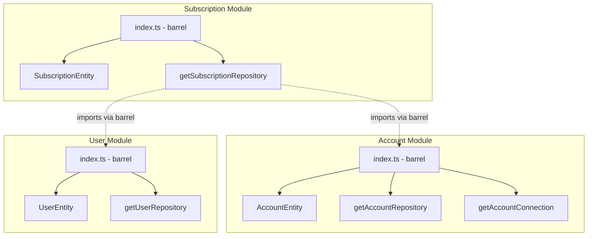

# DDD Architecture Improvements for subscription-management-service

## Overview

This plan provides a comprehensive analysis of the current `subscription-management-service` architecture against DDD textbook principles, with focused recommendations on aggregate boundaries, cross-module communication via barrel files, and connection patterns.

## Current Architecture Analysis

### What's Working Well

1. **Modular Structure** (`src/modules/`)

    - Clean separation of bounded contexts (subscription, account, user)
    - Each module has its own layers (application, domain, http, infrastructure)
    - Follows the principle of high cohesion within modules

2. **Handler Pattern** (`src/modules/*/application/*.handler.ts`)

    - Replaces traditional service classes with focused command handlers
    - Each handler has a single responsibility
    - Clean separation between command execution and domain logic

3. **Entity Design** (`src/modules/*/domain/*.entity.ts`)

    - Entities encapsulate business logic
    - Factory methods for creation (e.g., `SubscriptionEntity.new()`)
    - TypeORM with Data Mapper pattern keeps persistence concerns separate

4. **Repository Pattern** (`src/modules/*/infrastructure/*.repository.ts`)

    - Abstract repositories in domain layer
    - Concrete implementations in infrastructure layer
    - Clean dependency inversion with getter functions (e.g., `getAccountRepository()`)

5. **Event-Driven Architecture** (`src/shared/kafka/events/`)

    - Kafka events for cross-service communication
    - Event handlers for processing incoming events
    - Clear event naming conventions (past tense: `SubscriptionCreatedEvent`)
    - Shared package approach is correct for domain events

6. **Connection System** (`src/shared/query-connection/`)
    - Relay-style pagination with cursor-based navigation
    - Powerful where-filter language with operators (eq, contains, gt, etc.)
    - Automatic join detection from `field__relation__column` naming
    - Domain layer abstraction with getter pattern

---

## Improvement Plan

### Phase 1: Aggregate Boundaries (Priority: High)

**Problem:** Entity relationships are defined but aggregate boundaries aren't explicit. Child entities can be accessed and modified directly, bypassing the aggregate root.

**Current State:**

```typescript
// src/modules/subscription/domain/subscription.entity.ts
@OneToMany(() => AccountEntity, account => account.subscription, { cascade: true })
accounts: AccountEntity[];

@OneToMany(() => UserEntity, user => user.subscription, { cascade: true })
users: UserEntity[];
```

**Issue:** Nothing prevents `AccountEntity` from being created or modified independently, violating the aggregate's invariants.

**Recommendations:**

#### 1.1 Define Clear Aggregate Root Responsibility

Make `SubscriptionEntity` the gatekeeper for all operations on its child entities:

```typescript
// src/modules/subscription/domain/subscription.entity.ts
export class SubscriptionEntity {
    // ... existing fields ...

    /**
     * Aggregate method: Add account to subscription
     * Enforces business rules at aggregate level
     */
    addAccount(props: {
        entityType: UserEntityType;
        entityId: string;
        createdBy: string;
    }): AccountEntity {
        // Business rule: Check limits, uniqueness, etc.
        const existing = this.accounts.find(
            a => a.entityType === props.entityType && a.entityId === props.entityId,
        );
        if (existing) {
            throw AccountError.alreadyExists(props.entityId);
        }

        const account = AccountEntity.new({
            ...props,
            subscriptionId: this.id,
        });
        this.accounts.push(account);
        return account;
    }

    /**
     * Aggregate method: Remove account from subscription
     */
    removeAccount(accountId: string): void {
        const index = this.accounts.findIndex(a => a.id === accountId);
        if (index === -1) {
            throw AccountError.notFound(accountId);
        }
        // Business rule: Cannot remove last admin account
        const account = this.accounts[index];
        if (this.isLastAdmin(account)) {
            throw AccountError.cannotRemoveLastAdmin();
        }
        this.accounts.splice(index, 1);
    }

    private isLastAdmin(account: AccountEntity): boolean {
        // Business logic
        return false;
    }
}
```

#### 1.2 Protect Child Entity Construction

Child entities should only be created through the aggregate root:

```typescript
// src/modules/account/domain/account.entity.ts
export class AccountEntity {
    /**
     * @internal - Use SubscriptionEntity.addAccount() instead
     * Factory remains for aggregate root use only
     */
    static new(props: AccountCreateProps): AccountEntity {
        const account = new AccountEntity();
        // ... initialization
        return account;
    }
}
```

#### 1.3 Repository Design for Aggregates

The repository should load the complete aggregate:

```typescript
// src/modules/subscription/domain/subscription.repository.ts
export abstract class SubscriptionRepository {
    /**
     * Loads subscription with all its accounts and users
     * This is the only way to access child entities for modification
     */
    abstract get(id: string): Promise<SubscriptionEntity | null>;

    /**
     * Saves the entire aggregate
     */
    abstract save(subscription: SubscriptionEntity): Promise<SubscriptionEntity>;
}
```

**Files to Modify:**

- `src/modules/subscription/domain/subscription.entity.ts` - Add aggregate methods
- `src/modules/account/domain/account.entity.ts` - Document internal factory
- `src/modules/subscription/domain/subscription.repository.ts` - Define aggregate loading

---

### Phase 2: Cross-Module Communication via Barrel Files (Priority: High)

**Problem:** You need to access repositories from other modules synchronously within the same transaction or call.

**Solution: Treat Modules as NPM Packages**

Each module exports only what's needed by other modules through a barrel file (`index.ts`). Internal implementation details stay private.

#### 2.1 Module Barrel File Structure

```
src/modules/account/
├── index.ts                    ← PUBLIC API (barrel file)
├── domain/
│   ├── index.ts               ← Internal barrel (domain layer)
│   ├── account.entity.ts
│   └── account.repository.ts
├── infrastructure/
│   └── ...
└── http/
    └── ...
```

#### 2.2 Account Module Barrel

```typescript
// src/modules/account/index.ts
/**
 * Account Module Public API
 * Only export what other modules need
 */

// Entities (for type references and aggregate relationships)
export { AccountEntity } from './domain/account.entity.js';

// Repository getter and type (for cross-module transactions)
export { getAccountRepository, AccountRepository } from './domain/account.repository.js';

// Query getter (for cross-module reads)
export { getAccountConnection } from './domain/account-query.connection.js';

// Types needed by other modules
export type { AccountCreateProps } from './domain/account.entity.js';
```

#### 2.3 Subscription Module Barrel

```typescript
// src/modules/subscription/index.ts
/**
 * Subscription Module Public API
 */

export { SubscriptionEntity } from './domain/subscription.entity.js';
export {
    getSubscriptionRepository,
    SubscriptionRepository,
} from './domain/subscription.repository.js';
export type { SubscriptionCreateProps } from './domain/subscription.entity.js';
```

#### 2.4 User Module Barrel

```typescript
// src/modules/user/index.ts
/**
 * User Module Public API
 */

export { UserEntity } from './domain/user.entity.js';
export { getUserRepository, UserRepository } from './domain/user.repository.js';
export type { UserCreateProps } from './domain/user.entity.js';
```

#### 2.5 Usage in Cross-Module Operations

```typescript
// src/modules/subscription/application/subscription.create.handler.ts

// Import from module barrel, not internal paths
import {
    getAccountRepository,
    AccountRepository,
    AccountEntity,
} from '#app/modules/account/index.js';
import { getUserRepository, UserRepository } from '#app/modules/user/index.js';

export class SubscriptionCreateHandler extends AbstractService<...> {
    constructor(protected manager: AbstractTransactionManager) {
        super(manager);
    }

    protected async runInTransaction(
        command: SubscriptionCreateCommand,
    ): Promise<SubscriptionEntity> {
        // Use repository via getter pattern
        const subscription = await this.subscriptionRepository.preserveNew({...});

        // Cross-module access - same pattern
        const account = await this.accountRepository.preserveNew({...});
        subscription.addAccount(account);

        return subscription;
    }

    // Repository getters - your established pattern
    private get subscriptionRepository(): SubscriptionRepository {
        return getSubscriptionRepository(this.manager);
    }

    // Cross-module repositories use same getter pattern
    private get accountRepository(): AccountRepository {
        return getAccountRepository(this.manager);
    }

    private get userRepository(): UserRepository {
        return getUserRepository(this.manager);
    }
}
```

#### 2.6 What NOT to Export

Keep internal implementation private:

```typescript
// src/modules/account/index.ts

// DO NOT export these - internal implementation details:
// - DAOs (account.dao.ts)
// - TypeORM repositories (account.typeorm.repository.ts)
// - Internal helpers
// - HTTP controllers (accessed via routes, not imports)
```

#### 2.7 Import Convention

```typescript
// GOOD: Import from module barrel
import { AccountEntity, getAccountRepository } from '#app/modules/account/index.js';

// BAD: Import from internal path
import { AccountEntity } from '#app/modules/account/domain/account.entity.js';
import { getAccountRepository } from '#app/modules/account/domain/account.repository.js';
```

**Files to Create/Modify:**

- `src/modules/account/index.ts` - Create module barrel
- `src/modules/subscription/index.ts` - Create module barrel
- `src/modules/user/index.ts` - Create module barrel
- Update imports in handlers that use cross-module dependencies

---

### Phase 3: Connection Improvements (Priority: High)

**Current Architecture is Good.** The `TypeOrmConnection` pattern provides:

- Relay-style pagination (edges, nodes, pageInfo)
- Powerful filter operators (eq, contains, gt, in, etc.)
- Automatic join handling via `field__relation__column` naming
- Domain layer abstraction with `getAccountConnection()`

**Keeping "Connection" Name:** This construct gives us connections of any sort - not just queries. The name stays.

**Goals:**

1. **Dead simple user interface** - implement any connection in a short class
2. **`_query()` returns a QueryBuilder** - full freedom to select, join, apply permissions, do whatever
3. **`toResponseObject()` stays as is** - no changes to serialization
4. **Base class is just a tool** - knows nothing about domains, all domain logic stays in subclasses
5. **All complexity hidden** in the base class (the ugly for loop stays there)

---

#### 3.1 The User-Facing API (What You Write)

```typescript
// src/modules/account/infrastructure/account-query.typeorm.connection.ts

export class AccountTypeOrmConnection extends TypeOrmConnection<AccountDao, AccountNode> {
    constructor(protected user?: User) {
        super();
    }

    /**
     * Build query however you want.
     * Full control: select, join, permissions - everything domain-specific goes here.
     */
    protected _query(): SelectQueryBuilder<AccountDao> {
        const qb = getTypeOrmAccountRepository(new TypeOrmTransactionManager()).createQueryBuilder(
            'account',
        );

        // Domain-specific permission logic stays HERE, not in base class
        if (this.user) {
            addUserViewPermissionFiltertoAccount(this.user, qb);
        }

        return qb;
    }

    protected toResponseObject(literal: AccountDao): AccountNode {
        return toAccountNode(literal.toEntity);
    }
}
```

**That's it.** `_query()` gives you the QueryBuilder. Apply your domain permissions. Do whatever you want.

---

#### 3.2 With Joins (Full Freedom)

```typescript
// src/modules/account/infrastructure/account-with-subscription.connection.ts

export class AccountWithSubscriptionConnection extends TypeOrmConnection<
    AccountDao,
    AccountWithSubNode
> {
    constructor(protected user?: User) {
        super();
    }

    protected _query(): SelectQueryBuilder<AccountDao> {
        const qb = getTypeOrmAccountRepository(new TypeOrmTransactionManager())
            .createQueryBuilder('account')
            .leftJoinAndSelect('account.subscription', 'sub')
            .leftJoinAndSelect('sub.owner', 'owner');

        if (this.user) {
            addUserViewPermissionFiltertoAccount(this.user, qb);
        }

        return qb;
    }

    protected toResponseObject(literal: AccountDao): AccountWithSubNode {
        return {
            ...toAccountNode(literal.toEntity),
            subscription: {
                id: literal.subscription.id,
                name: literal.subscription.name,
                ownerEmail: literal.subscription.owner.email,
            },
        };
    }
}
```

---

#### 3.3 The Base Class (Just a Tool)

```typescript
// src/shared/query-connection/pagination/typeorm/typeorm-connection.ts
// A TOOL. Knows nothing about domains. All the ugly stuff lives here.

import { ObjectLiteral, SelectQueryBuilder } from 'typeorm';

export abstract class TypeOrmConnection<TDao extends ObjectLiteral, TNode> {
    /**
     * SUBCLASS IMPLEMENTS: Build your query however you want
     * Full access to QueryBuilder - select, join, permissions, whatever
     * All domain-specific logic belongs here, not in this base class
     */
    protected abstract _query(): SelectQueryBuilder<TDao>;

    /**
     * SUBCLASS IMPLEMENTS: Transform a database row to API response
     * Keep as is - no changes
     */
    protected abstract toResponseObject(literal: TDao): TNode;

    /**
     * Execute the connection - applies filters, pagination, returns results
     */
    async data(params: ConnectionParams): Promise<IConnection<TNode>> {
        const qb = this._query();

        // Apply filters (the ugly for loop lives here)
        this.filterQueryBuilder(qb, params.filters, params.search);

        // Apply ordering
        this.sortQueryBuilder(qb, params.orderBy);

        // Apply pagination
        this.paginateQueryBuilder(qb, params.page);

        const [literals, totalCount] = await qb.getManyAndCount();

        return this.transform(literals, totalCount, params.page);
    }

    // ... all the existing private methods stay as is ...
    // filterQueryBuilder, sortQueryBuilder, paginateQueryBuilder, transform, etc.
    // THE UGLY FOR LOOP stays here
}
```

---

#### 3.4 Domain Layer Getter (Same Pattern)

```typescript
// src/modules/account/domain/account-query.connection.ts

export function getAccountConnection(user?: User): AccountTypeOrmConnection {
    return new AccountTypeOrmConnection(user);
}
```

---

#### 3.5 Controller Usage

```typescript
// src/modules/account/http/v1/account.list.controller.ts

const connection = getAccountConnection(auth(request, response));

const result = await connection.data({
    filters: request.query.filters,
    orderBy: request.query.orderBy,
    page: { first: request.query.first, after: request.query.after },
});

response.send(result);
```

---

#### 3.6 Summary: What Subclass Writes vs What Base Handles

| Subclass (Domain)                    | Base Class (Tool)                           |
| ------------------------------------ | ------------------------------------------- |
| `_query()` - returns QueryBuilder    | The ugly filter for loop                    |
| Permission filters (domain-specific) | All operator handling (eq, contains, gt...) |
| `toResponseObject()` - DAO → Node    | Cursor-based pagination math                |
| Joins, selects, custom conditions    | Edge/node/pageInfo construction             |

**Key principle:** Base class is a **tool**. It can't know about `addUserViewPermissionFiltertoAccount` or any domain logic. All that stays in the subclass's `_query()` method.

---

**Files to Modify:**

- `src/shared/query-connection/pagination/typeorm/typeorm-connection.ts` - Refactor to new pattern

**Files to Create:**

- `src/shared/query-connection/pagination/tool/connection.types.ts` - Shared types

**Migration:** Update existing connections one at a time. Both patterns can coexist during migration.

---

## Implementation Priority

| Phase                              | Effort | Impact | Priority |
| ---------------------------------- | ------ | ------ | -------- |
| Phase 2: Cross-Module Barrel Files | Low    | High   | 1        |
| Phase 3: Connection Improvements   | Medium | High   | 2        |
| Phase 1: Aggregate Boundaries      | Medium | High   | 3        |

## Acceptance Criteria

- [ ] Module barrel files (`index.ts`) created for account, subscription, and user modules
- [ ] Cross-module imports use barrel files only
- [ ] Refactored `TypeOrmConnection` with `_query()` method pattern
- [ ] `_query()` returns QueryBuilder - subclass has full control
- [ ] `toResponseObject()` unchanged
- [ ] Domain-specific logic (permissions) stays in subclass, not base
- [ ] Base class remains a pure tool - no domain knowledge
- [ ] All filter/pagination complexity remains in base class
- [ ] Aggregate methods added to SubscriptionEntity
- [ ] All existing tests continue to pass

## Deferred Items (Future Work)

These items are intentionally deferred for later consideration:

1. **Value Objects** - Will revisit with proper TypeBox validation integration
2. **Strongly-Typed Identifiers (EntityId)** - Will implement proper URN pattern later
3. **Result Type Pattern** - Current error package is sufficient

## References

### Internal References

- Current entities: `src/modules/*/domain/*.entity.ts`
- Current handlers: `src/modules/*/application/*.handler.ts`
- Kafka events: `src/shared/kafka/events/`
- Query connection: `src/shared/query-connection/`
- Where filter: `src/shared/query-connection/where-filter/`

### External References

- DDD Reference by Eric Evans: https://www.domainlanguage.com/ddd/reference/
- Implementing Domain-Driven Design by Vaughn Vernon
- Relay Cursor Connections Spec: https://relay.dev/graphql/connections.htm

### Mermaid: Module Structure


