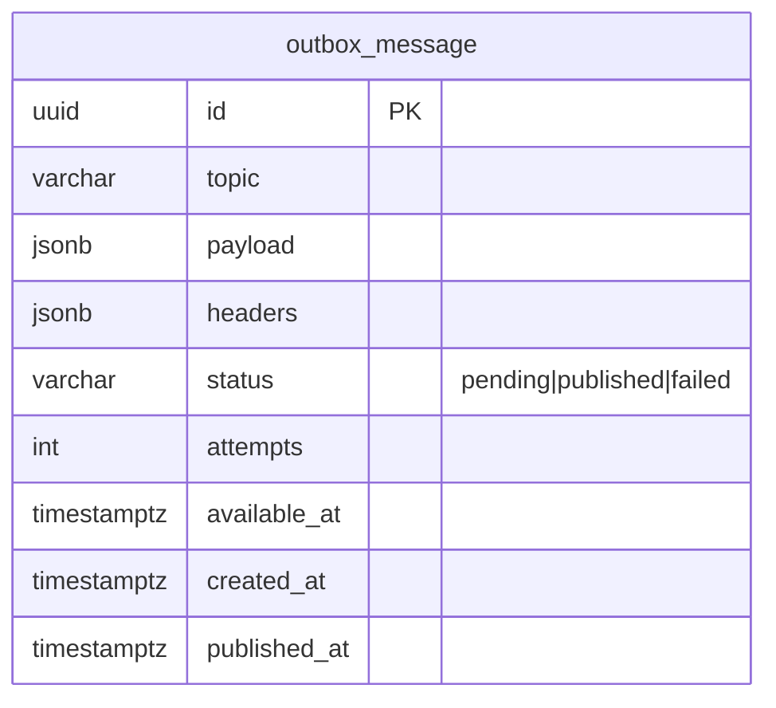

# 🧱 DDD exemplars — reference patterns for subscription-management-service

**Date:** 2026-08-04
**Base:** `origin/development` @ `ead011f` (verified against live code — no stale coordinates)
**Type:** feature (reference patterns) + one bug fold-in
**Status:** proposed

## Goal

This is a **cheatsheet repo** — patterns get copy-pasted _out_ of it. A fresh DDD audit of current
develop graded it **C+**: strong CQS + ports/adapters + a real Anti-Corruption Layer, but an **anemic
domain**, a **dual-write** (no outbox), and **zero boundary enforcement**. Value Objects, Factories, and
Domain Services are entirely absent, and the "domain events" are handler-published entity snapshots.

So this plan does **not** rewrite the repo. It adds **one copyable, reference-quality exemplar of each
missing pattern**, so a reader has a correct example to lift:

1. **A rich aggregate** — `AccountInvitationEntity` (private ctor + validating factory + enforced invariant + immutable transition).
2. **Value Objects** — `Email` (self-validating) and `Token` (the aggregate's credential).
3. **A transactional outbox** — kill the Kafka-publish-inside-the-DB-tx dual-write.
4. **Enforced module boundaries** — a `dependency-cruiser` config, in CI.

Each is small, self-contained, and grounded in the canon (Evans building blocks; Vernon aggregate rules;
Wlaschin functional-DDD; Richardson transactional outbox).

## Non-goals

- Making _all 9_ entities rich (only one exemplar).
- Moving SES/Cognito out of the tx or compensating them (that needs a post-commit seam + saga — separate; noted under Outbox).
- Breaking the two cross-module ORM cycles (baked into `@OneToMany`/`@ManyToOne` across module DAOs — the boundary config _documents_ them, doesn't rip them out).
- Switching stacks (stay on Fastify + TypeBox + TypeORM + KafkaJS + Cognito, `oxlint` + `tsgo`).

---

## Exemplar 1 — Rich aggregate: `AccountInvitationEntity`

**Why this one:** it already holds the domain's cleanest invariant (`revoke()`: must be valid + owned), it's
the smallest blast radius (constructed in one DAO getter, mutated in one handler), and its creation rule
(a new invitation ⇒ `isValid:true` + a token) currently lives in **infrastructure** — the exact leak a
factory fixes. It demonstrates the full pattern: private ctor, validating `create()`, no-revalidation
`reconstitute()`, `readonly` fields, and an **immutable** state transition.

**Current state (verified):**

- `src/modules/account/domain/account-invitation.entity.ts` — public-mutable ctor fields; `revoke(user)` mutates `this.isValid = false` and returns `this`.
- `src/modules/account/infrastructure/account-invitation.typeorm.repository.ts:27-39` — `provide()` generates `token = randomUUID()` + `isValid = true` **in infra** (the invariant leak); `preserve(id, input: Partial<AccountEntity>)` **:53** uses the **wrong entity type** (`AccountEntity`, should be `AccountInvitationEntity`).
- `src/modules/account/infrastructure/account-invitation.dao.ts:31` — `@Column({ default: randomUUID() })` is **evaluated once at class-load** → every tokenless row shares one UUID (real bug); `toEntity` getter does `new AccountInvitationEntity(...)`.
- No `UNIQUE(token)` constraint (verify auth is token-only).

**Change:**

```ts
// account-invitation.entity.ts  (sketch)
export class AccountInvitationEntity {
    private constructor(
        readonly id: string,
        readonly accountId: string,
        readonly token: Token,             // ← VO (Exemplar 2)
        readonly isValid: boolean,
        readonly createdAt: Date,
        readonly createdBy: string | undefined,
        // …readonly audit fields
    ) {}

    /** Write path — enforces the creation invariant in the DOMAIN, not the repo. */
    static create(props: { accountId: string; createdBy: string }): AccountInvitationEntity {
        return new AccountInvitationEntity(
            crypto.randomUUID(), props.accountId, Token.create(), /* isValid */ true, new Date(),
            props.createdBy, /* … */,
        );
    }

    /** Rehydration from persistence — no re-validation of already-trusted data. */
    static reconstitute(row: AccountInvitationData): AccountInvitationEntity { /* … */ }

    /** Immutable state transition — returns a NEW instance, does not mutate this. */
    revoke(user: User): AccountInvitationEntity {
        if (!this.isValid || this.accountId !== user.accountId) {
            throw new InternalServerError(CommonError.FORBIDDEN);
        }
        return AccountInvitationEntity.reconstitute({ ...this, isValid: false, updatedBy: user.accountId });
    }
}
```

**Touch-points:**
| File | Change |
|---|---|
| `account/domain/account-invitation.entity.ts` | private ctor + `create()`/`reconstitute()` + `readonly` + immutable `revoke()` |
| `account/infrastructure/account-invitation.dao.ts` | `toEntity` → `reconstitute(...)`; **drop** `@Column({ default: randomUUID() })` (`:31`); add `@Column({ unique: true })` on `token` |
| `account/infrastructure/account-invitation.typeorm.repository.ts` | `provide()` builds via `AccountInvitationEntity.create(...)` → map to DAO for `save` (can't `save` a domain entity — a domain→DAO mapping step is required); **fix** `preserve` param type `Partial<AccountEntity>` → `Partial<AccountInvitationEntity>` (`:53`) |
| `account/infrastructure/account-invitation.repository.ts` | interface signatures against the readonly entity |
| `account/application/person-account.verify.handler.ts` | `revoke()` now returns a new instance → pass it to `preserve()` |
| `src/database/migrations/<ts>-account-invitation-token-unique.ts` | add `UNIQUE(token)` (raw-SQL style, matching the sole existing migration) |

**⚠️ Label it:** doc-comment this as _the one_ rich-aggregate reference; the other 8 entities stay anemic on purpose (so a copyist doesn't half-migrate).

**Tests:** construction only via factory; `create()` yields `isValid:true` + a valid token; `revoke()` returns a new instance, original unchanged; `revoke()` throws for non-owner / already-revoked; `reconstitute` from a row incl. soft-deleted.

---

## Exemplar 2 — Value Objects: `Email` and `Token`

**Why:** the domain that most wants VOs uses raw `string` — `ContactDetailEntity.detail` (the email) and
`AccountInvitationEntity.token`. Two small VOs demonstrate the two classic flavours: a **self-validating**
value (`Email`) and an **opaque generated credential** (`Token`, owned by the aggregate in Exemplar 1).

**`Email`** — immutable, validates on construction, equality-by-value:

```ts
// src/modules/contact-detail/domain/email.value.ts  (sketch)
export class Email {
    private constructor(readonly value: string) {}
    static create(raw: string): Email {
        const normalized = raw.trim().toLowerCase();
        if (!/^[^@\s]+@[^@\s]+\.[^@\s]+$/.test(normalized)) {
            throw new InternalServerError(CommonError.VALIDATION, {
                resource: 'Email',
                value: raw,
            });
        }
        return new Email(normalized);
    }
    equals(other: Email): boolean {
        return this.value === other.value;
    }
    toString(): string {
        return this.value;
    }
}
```

- **Boundary:** parse at the create-command edge (the TypeBox request already validates _shape_; the VO
  validates the _domain rule_ + normalizes). Used by `ContactDetailEntity` (`detail: Email` when type=EMAIL)
  and the `isEmailAlreadyTaken` check.
- **Keep it demonstrative, not invasive:** scope to the contact-detail create/lookup path; do not thread it through every DTO (the TypeBox wire types stay `string`; convert at the domain boundary).

**`Token`** — generated + validated in the domain, consumed by `AccountInvitationEntity.create()`:

```ts
// src/modules/account/domain/token.value.ts  (sketch)
export class Token {
    private constructor(readonly value: string) {}
    static create(): Token {
        return new Token(crypto.randomUUID());
    }
    static fromString(raw: string): Token {
        /* validate uuid */ return new Token(raw);
    }
    equals(other: Token): boolean {
        return this.value === other.value;
    }
    toString(): string {
        return this.value;
    }
}
```

This is what removes the `randomUUID()` from infra (`account-invitation.typeorm.repository.ts:28` + the DAO default) — generation moves into `Token.create()`, called by the aggregate factory.

**Touch-points:** new `email.value.ts` + `token.value.ts`; `AccountInvitationEntity` uses `Token`;
`ContactDetailEntity.detail` typed `Email` (map `string`↔`Email` in the DAO `toEntity`/`toDao`);
`contact-detail` repo `isEmailAlreadyTaken(Email)`; the create handler converts `command.email → Email.create(...)`.

**Tests:** `Email.create` rejects malformed, normalizes case/trim, `equals` by value; `Token.create` yields a valid uuid; round-trip `fromString`.

---

## Exemplar 3 — Transactional outbox (kills the dual-write)

**The problem (verified):** `subscription.create.handler.ts:82` and `subscription.update.handler.ts:42`
call `await eventProducer.publish(...)` **inside the open DB transaction**, and
`AbstractTransactionManager` (`src/shared/transaction/tool/abstract.transaction-manager.ts`) exposes
**no after-commit seam**. So a rollback-after-publish emits a phantom event; a publish-failure rolls back a
good write. The outbox is the correct fix precisely because there's no commit hook to hang a post-commit
publish on.

**Design (Richardson):** write the event as a **row in the same transaction** as the business write (via a
tx-bound repo that joins `manager.context`), then a **relay** drains pending rows and publishes them.



**Touch-points:**
| Artifact | Detail |
|---|---|
| Migration `src/database/migrations/<ts>-outbox.ts` | create `outbox_message` (raw SQL, matching `1744917689309-initial-migration.ts`); index `(status, available_at)` |
| New module `src/modules/outbox/` | `domain/outbox-message.entity.ts` + `infrastructure/outbox-message.dao.ts` + `outbox-message.repository.ts` (interface + `getOutboxRepository(manager)`) + `outbox-message.typeorm.repository.ts` — **must resolve `manager.context`** so the INSERT joins the business tx (mirror `account-invitation.typeorm.repository.ts:58-63`) |
| `subscription.create.handler.ts:82`, `subscription.update.handler.ts:42` | replace `eventProducer.publish(evt.get())` with `outboxRepository.enqueue(evt.get())` on the **tx-bound** repo (store the composed, validated `ProducerRecord` — `AbstractKafkaEvent.get()` validates on call) |
| Relay `src/event-listener/outbox-relay.daemon.ts` | poll `status='pending' AND available_at <= now()` → `eventProducer.publish`/`producer.send` → mark `published`; backoff via `available_at` + `attempts`; `start()` must **resolve** (self-rescheduling timer, like the existing daemons — don't block `Application`'s `Promise.all`) |
| Runnable wiring | register the relay daemon in the event-listener runnable's `daemons: [...]` (co-locate — don't mint a third process) |

**Note (out of scope, flag as follow-up):** SES email and Cognito calls also fire in-tx. Cognito is
non-transactional and returns data synchronously → it can't be outboxed; it needs a **post-commit seam on
`AbstractTransactionManager` + compensation** (the verify flow would otherwise leave an orphaned Cognito
user). This exemplar fixes the **event** dual-write only; the SES/Cognito seam is a named next step.

**Tests:** DB-commit failure after enqueue → no `outbox_message` row + nothing published; enqueue joins the
tx (assert the row is in the same `txid_current`); relay publishes a pending row then marks it published;
crash between commit and relay → event still published on next poll.

---

## Exemplar 4 — Enforced module boundaries (`dependency-cruiser`)

**The gap (verified):** there is **no** boundary enforcement — `oxlint` runs on defaults with no config,
no `dependency-cruiser`, no import rules. So the 3 cross-module app→app calls into `authentication` and the
two module cycles are unpoliced; a 6th cross-module call would pass CI silently.

**Change:**

- Add `dependency-cruiser` (devDep) + `.dependency-cruiser.cjs` at repo root. Resolve the `#app/*` alias to
  **`src`** (tsconfig `paths`) via `--ts-config ./tsconfig.json` + `enhancedResolveOptions` — the
  package.json `imports` map points at `./build/`, so force the source root or it mis-resolves.
- `depcruise` script + a step in CI (`lint-and-test.yml` runs oxlint/tsgo/prettier as separate steps — add an explicit `depcruise` step; folding into `npm run lint` wouldn't run in CI).
- **Rules:**
    1. `no-cross-module-domain` — `modules/<A>/domain/**` must not import `modules/<B>/**`.
    2. `no-app-to-foreign-app` — `modules/<A>/application/**` must not import `modules/<B>/application/**` (the 3 `authentication` calls).
    3. `no-app-to-foreign-domain-infra` — `modules/<A>/application/**` must not import `modules/<B>/{domain,infrastructure}/**`.
    4. `no-module-cycles` — `{ to: { circular: true } }`.
- **⚠️ Sequencing:** the codebase currently **violates** all of these (the two ORM cycles + the 3 app→app
  edges + the god orchestration handler). Ship the rules at **`warn`** (or with an explicit `allow` list of
  the known violations) so CI stays green; the value is the **guardrail against new violations** + a visible
  backlog. A `no-cycle` at `error` would require breaking the cross-module `@OneToMany` relations first (real
  refactor, out of scope here).

**Tests:** a meta-test — a fixture import that crosses a forbidden boundary makes `depcruise` exit non-zero.

---

## Landing sequence

Largely independent; suggested order by value + isolation:

1. **Exemplar 4 (boundaries)** — cheapest, highest guardrail value; land at `warn` first.
2. **Exemplar 2 (VOs)** — small, self-contained; `Token` unblocks the aggregate factory.
3. **Exemplar 1 (rich aggregate)** — uses `Token`; folds in the frozen-default + mistype + `UNIQUE(token)` fixes.
4. **Exemplar 3 (outbox)** — the biggest; new module + migration + relay.

Each exemplar is a small PR-sized commit set, `oxlint` + `tsgo` clean, with the tests above added to
`src/__tests__/test.global.runner.ts` (the runner is a hardcoded file list — unregistered tests don't run).

## Definition of done

- [ ] `AccountInvitationEntity` constructible only via factory; invariant enforced; immutable `revoke()`; frozen-default dropped; `UNIQUE(token)`; `preserve` retyped. Labeled as the one rich aggregate.
- [ ] `Email` + `Token` VOs — self-validating, immutable, equality-by-value; used at their domain boundaries; `randomUUID` gone from infra.
- [ ] Zero event publishing inside an open DB tx — the two publish sites enqueue to a tx-bound outbox; a relay drains it; SES/Cognito seam flagged as follow-up.
- [ ] `dependency-cruiser` in CI (at `warn`) with the four rules; a meta-test proves it catches a forbidden import.
- [ ] Each exemplar documented in the README as a copy-ready reference.

## References

- Tx-bound repo to mirror: `src/modules/account/infrastructure/account-invitation.typeorm.repository.ts:58-63`
- Migration template: `src/database/migrations/1744917689309-initial-migration.ts`
- Event publish sites: `subscription.create.handler.ts:82`, `subscription.update.handler.ts:42`
- Transactional Outbox — Chris Richardson, https://microservices.io/patterns/data/transactional-outbox.html
- Aggregates / factories / VOs — Evans (DDD), Vernon "Effective Aggregate Design"
- Immutable domain / make-illegal-states-unrepresentable — Scott Wlaschin, "Domain Modeling Made Functional"
- dependency-cruiser — https://github.com/sverweij/dependency-cruiser
