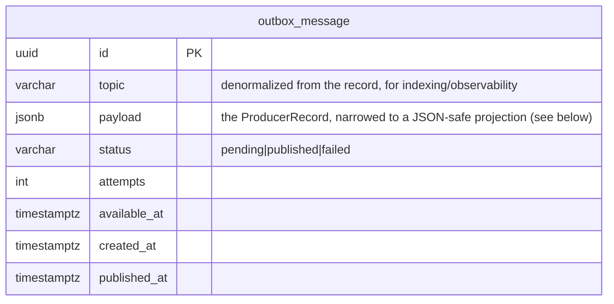

# 🧱 DDD exemplars — reference patterns for subscription-management-service

**Date:** 2026-08-04
**Base:** `origin/development` @ `ead011f` (verified against live code — no stale coordinates)
**Type:** feature (reference patterns) + one bug fold-in
**Status:** reviewed — 5-agent pass folded in (see _Review corrections_ at end)

## Goal

This is a **cheatsheet repo** — patterns get copy-pasted _out_ of it. A fresh DDD audit of current
develop graded it **C+**: strong CQS + ports/adapters + a real Anti-Corruption Layer, but an **anemic
domain**, a **dual-write** (no outbox), and **zero boundary enforcement**. Value Objects, Factories, and
Domain Services are entirely absent, and the "domain events" are handler-published entity snapshots.

So this plan does **not** rewrite the repo. It adds **one copyable, reference-quality exemplar of each
missing pattern**, so a reader has a correct example to lift:

1. **A rich aggregate** — `AccountInvitationEntity` (private ctor + validating factory + enforced invariant + immutable transition).
2. **Value Objects** — `Email` (self-validating) and `Token` (the aggregate's credential).
3. **A transactional outbox** — kill the Kafka-publish-inside-the-DB-tx dual-write.
4. **Enforced module boundaries** — a `dependency-cruiser` config, in CI.

Each is small, self-contained, and grounded in the canon (Evans building blocks; Vernon aggregate rules;
Wlaschin functional-DDD; Richardson transactional outbox).

**New conventions this plan coins** (called out because a cheatsheet's coinages get copied verbatim, so they
must be _deliberate_): the `.value.ts` file suffix for Value Objects (sits beside `.entity.ts` — the repo
has no prior VO suffix), and the `enqueue` outbox repo verb (steps outside the repo's `provide` /
`preserveNew` / `preserve` write vocabulary, but is domain-accurate for an outbox). Both are intentional.

## Non-goals

- Making _all 9_ entities rich (only one exemplar). Immutable transitions are the **directional target**; the
  mutate-`this` style in the other 8 entities (incl. `SubscriptionEntity.addAccount`) is the **legacy baseline** — the
  label on Exemplar 1 must say so, or a reader sees two contradictory transition idioms with no signpost.
- Moving SES/Cognito out of the tx or compensating them — separate work (a post-commit seam + saga). **⚠️ These
  remain _live_ data-integrity hazards after this plan lands** (see Outbox note), not merely "future polish."
- Breaking the two cross-module ORM cycles (baked into `@OneToMany`/`@ManyToOne` across module DAOs — the boundary config _documents_ them, doesn't rip them out).
- Switching stacks (stay on Fastify + TypeBox + TypeORM + KafkaJS + Cognito, `oxlint` + `tsgo`).

---

## Exemplar 1 — Rich aggregate: `AccountInvitationEntity`

**Why this one:** it already holds the domain's cleanest invariant (`revoke()`: must be valid + owned), it's
the smallest blast radius (constructed in one DAO getter, mutated in one handler), and its creation rule
(a new invitation ⇒ `isValid:true` + a token) currently lives in **infrastructure** — the exact leak a
factory fixes. It demonstrates the full pattern: private ctor, validating `create()`, no-revalidation
`reconstitute()`, `readonly` fields, and an **immutable** state transition.

**Current state (verified):**

- `src/modules/account/domain/account-invitation.entity.ts` — public-mutable ctor fields; `revoke(user)` mutates `this.isValid = false` and returns `this`.
- `src/modules/account/infrastructure/account-invitation.typeorm.repository.ts:27-39` — `provide()` generates `token = randomUUID()` + `isValid = true` **in infra** (the invariant leak); `preserve(id, input: Partial<AccountEntity>)` **:53** uses the **wrong entity type** (`AccountEntity`, should be `AccountInvitationEntity`).
- `src/modules/account/domain/account-invitation.repository.ts` — the **interface + `getAccountInvitationRepository(manager)` selector live here (in `domain/`)**; `preserve`'s param carries the **same `Partial<AccountEntity>` mistype**. Both interface + impl must be retyped in lockstep or the build breaks (the sole caller passes an `AccountInvitationEntity`; it only compiles today by loose structural overlap).
- `src/modules/account/infrastructure/account-invitation.dao.ts:31` — `@Column({ default: randomUUID() })` is **evaluated once at class-load** → every tokenless row shares one UUID (real bug); `toEntity` getter does `new AccountInvitationEntity(...)`.
- No `UNIQUE(token)` constraint (verify auth is token-only).

**Change:**

```ts
// account-invitation.entity.ts  (sketch)
import { randomUUID } from 'node:crypto'; // repo convention — NOT global crypto.randomUUID()

/** Raw persistence shape — plain scalars/dates/relation (token is the string DB column). */
type AccountInvitationData = {
    id: string;
    accountId: string;
    token: string;
    isValid: boolean;
    createdAt: Date;
    createdBy: string | undefined;
    // …audit fields, plain scalars/dates only — no VOs, no relations
};

export class AccountInvitationEntity {
    private constructor(
        readonly id: string,
        readonly accountId: string,
        readonly token: string,            // generated via the Token VO, stored as a string
        readonly isValid: boolean,
        readonly createdAt: Date,
        readonly createdBy: string | undefined,
        // …readonly audit fields
    ) {}

    /** Write path — enforces the creation invariant in the DOMAIN, not the repo. */
    static create(props: { accountId: string; createdBy: string }): AccountInvitationEntity {
        return new AccountInvitationEntity(
            randomUUID(), props.accountId, Token.create().toString(), /* isValid */ true, new Date(),
            props.createdBy, /* … */,
        );
    }

    /** Rehydration from persistence — NO re-validation of already-trusted data. Called by the DAO getter. */
    static reconstitute(row: AccountInvitationData): AccountInvitationEntity {
        return new AccountInvitationEntity(
            row.id, row.accountId, row.token, row.isValid, row.createdAt, row.createdBy, /* … */,
        );
    }

    /** Immutable state transition — returns a NEW instance via the private ctor (keeps the token;
     *  does NOT spread `...this` — that would drag the `account` relation into a raw-row shape). */
    revoke(user: User): AccountInvitationEntity {
        if (!this.isValid || this.accountId !== user.accountId) {
            throw new InternalServerError(CommonError.FORBIDDEN);
        }
        return new AccountInvitationEntity(
            this.id, this.accountId, this.token, /* isValid */ false, this.createdAt, this.createdBy, /* updatedBy */ user.accountId,
        );
    }
}
```

**⚠️ Token stored as a `string`, not a `Token` field (decided during implementation):** the credential is
generated in the domain via `Token.create()` — which is what removes `randomUUID` from infra (the actual
leak) — but the persisted field stays a normalized `string`. Typing it `Token` ripples destructively:
`AccountEntity` embeds `invitations: AccountInvitationEntity[]`, and the account repo maps domain→DAO
**structurally** (`preserveNew`/`preserve`/`softDelete`, plus `softRemove(account as AccountEntity)`), all
relying on `token: string`. A `Token` field breaks the account aggregate's persistence and forces either
unverifiable account-repo surgery or `as unknown as` casts (bad in a copy-out reference). Same call as the
`Email` boundary VO — apply the VO at the seam, persist a primitive. `verify.handler` + `send-invitation`
read `token` as a `string`, so they stay unchanged.

**Touch-points:**
| File | Change |
|---|---|
| `account/domain/account-invitation.entity.ts` | private ctor + `create()`/`reconstitute(AccountInvitationData)` + `readonly` + immutable `revoke()` (via private ctor, no `...this` spread) |
| `account/domain/account-invitation.repository.ts` | **interface lives here** — retype `preserve` param `Partial<AccountEntity>` → `Partial<AccountInvitationEntity>` (mistype #1 of 2); signatures against the readonly entity |
| `account/infrastructure/account-invitation.dao.ts` | `toEntity` → `reconstitute(...)` (passes the raw **string** token, plain dates); **drop** `@Column({ default: randomUUID() })` (`:31`); add `@Column({ unique: true })` on `token` |
| `account/infrastructure/account-invitation.typeorm.repository.ts` | `provide()` builds via `AccountInvitationEntity.create(...)`, then **maps domain→DAO** (`this.create({ …, token: entity.token })`) — no `toDao` mapper exists in this repo; field-map inline, the mirror of `get toEntity()`. **`preserve` must field-map to scalar columns only** — `this.update({ id }, { isValid, updatedBy })` — NOT hand the whole entity (nested `account` relation) to `.update()`. Retype the param (mistype #2 of 2) `:53` |
| `account/application/person-account.verify.handler.ts` | `revoke()` returns a new instance → pass it to `preserve()` (already captures the return today, so transparent) |
| `src/__tests__/factories/account-invitation.factory.ts` | builds via `AccountInvitationDao.create(...)` (DAO, not the domain entity) → private-ctor change is safe, **but** under `UNIQUE(token)` any fixture creating >1 invitation must seed **distinct** tokens |
| `src/database/migrations/<ts>-account-invitation-token-unique.ts` | the token migration — see **Migration safety** below (it is _not_ a clean one-line `ADD UNIQUE`) |

**⚠️ Migration safety (the `UNIQUE(token)` will FAIL on deploy if added naively):** the frozen default
`'3c8a0348-5d51-44eb-af03-8d77f28bc253'` is **baked into the DB** (`1744917689309-initial-migration.ts:112`), so
every tokenless row carries the identical string → `ADD CONSTRAINT … UNIQUE(token)` throws `duplicate key`. Required
sequence, all in one migration `up()`, deployed **atomically with the `Token.create()` code cutover**:

1. **Prod pre-check (before the migration runs):** `SELECT token, count(*) FROM account_invitation GROUP BY token HAVING count(*) > 1` on a prod-RO copy.
2. **Backfill / de-dupe:** `UPDATE account_invitation SET token = uuid_generate_v4()::varchar WHERE token = '3c8a0348-…'` (and any other dup groups). `uuid_generate_v4()` is available (initial migration uses it).
3. **Add a _partial_ unique index** `… UNIQUE(token) WHERE deleted_at IS NULL` (soft-delete-aware — `deletedAt` exists; a plain unique would count soft-deleted rows and block token re-issue).
4. **Drop the column DEFAULT** (`ALTER TABLE … ALTER COLUMN token DROP DEFAULT`) in the **same** migration — keep `NOT NULL`; the app now always supplies the token via `Token.create()`. The default-drop and the always-supply-token code are **one deploy** (drop-before-cutover on old code → `NOT NULL` violation on the tokenless path).
5. `down()`: drop the index (order matters), restore nothing (do not re-introduce the frozen default).

**⚠️ Label it:** doc-comment this as _the one_ rich-aggregate reference, and state that **immutable transitions are the
target** while the mutate-`this` style elsewhere (incl. `SubscriptionEntity.addAccount`) is legacy baseline — so a copyist
reading two entities side-by-side sees the intent, not a contradiction.

**Tests:** construction only via factory; `create()` yields `isValid:true` + a valid token; `revoke()` returns a new instance, original unchanged; `revoke()` throws for non-owner / already-revoked; `reconstitute` from a row incl. soft-deleted; `revoke()→preserve()` persists **scalar columns only** (no Token/relation object reaches `.update()`).

---

## Exemplar 2 — Value Objects: `Email` and `Token`

**Why:** the domain that most wants VOs uses raw `string` — `ContactDetailEntity.detail` (the email) and
`AccountInvitationEntity.token`. Two small VOs demonstrate the two classic flavours **and two different
lifecycles**: a **self-validating boundary value** (`Email`) and an **opaque generated credential**
(`Token`, owned by the aggregate in Exemplar 1).

- `Email` is a **boundary VO**: parsed from a raw string at the create/lookup edge and immediately reduced
  back to a normalized `string` for persistence + the wire. It is **not** the `ContactDetailEntity.detail`
  field type — `detail` is a **discriminated** column (keyed by `ContactDetailType`, part of the
  `[entityId, entityType, type, tag, detail]` unique index) that is only _sometimes_ an email, so typing the
  field `Email` would be incorrect and would ripple a VO through every cross-module reader. So `Email` needs
  only `create()` (+ `equals`/`toString`); there is no persisted-`Email` field to rehydrate.
- `Token` is a **generation VO**: the aggregate generates its credential via `Token.create()` (moving
  generation out of infrastructure — the actual leak) but stores it as a normalized `string`, not a `Token`
  field (see Exemplar 1: a `Token` field ripples destructively through the account aggregate's structural
  persistence). `Token` also carries a no-revalidation `reconstitute()`, shown for completeness — the
  trusted-rehydrate pattern for a codebase that DOES type a persisted field as a VO. The reconstitute-doesn't-
  revalidate lesson is owned here by the **aggregate** (`AccountInvitationEntity.reconstitute`), not the VO.

**`Email`** — immutable, validates + normalizes on `create`, equality-by-value:

```ts
// src/modules/contact-detail/domain/email.value.ts  (sketch — NOTE: `.value.ts` is a NEW suffix, see Goal)
export class Email {
    private constructor(readonly value: string) {}
    /** Boundary parse — validates the domain rule + normalizes. */
    static create(raw: string): Email {
        const normalized = raw.trim().toLowerCase();
        if (!/^[^@\s]+@[^@\s]+\.[^@\s]+$/.test(normalized)) {
            throw new InternalServerError(CommonError.VALIDATION, {
                resource: 'Email',
                value: raw,
            });
        }
        return new Email(normalized);
    }
    equals(other: Email): boolean {
        return this.value === other.value;
    }
    toString(): string {
        return this.value;
    }
}
```

- **Boundary:** parse at the create-command edge (`command.email → Email.create(...)` in `subscription.create.handler.ts:89`).
- **⚠️ SoT — normalization must be applied on BOTH write and lookup, or it silently weakens an existing invariant.**
  `Email.create` lowercases/trims, but today `isEmailAlreadyTaken` does a **raw `detail` equality query**
  (`contact-detail.typeorm.repository.ts:24-27`), the DB unique index is on **raw `detail`**
  (`initial-migration.ts:40-46`), and `preserveNew` spreads `input.detail` **unchanged** into `this.create({…})`
  (`:58-62`). If create normalizes but lookup/store don't, the "already taken" check misses case-variant duplicates
  and the unique index won't catch them either. Both the stored `ContactDetailDao.detail` and the
  `isEmailAlreadyTaken` argument must be the **normalized** value. (The `isEmailAlreadyTaken` pre-check stays a
  non-atomic TOCTOU advisory — the real guarantee is the unique index; note that, don't try to fix it here.)
- **Keep it demonstrative, not invasive:** because `detail` stays a `string` on the entity / DAO / wire, the
  VO is confined to the create + lookup boundary — there is **no** cross-module ripple. The SES reads at
  `subscription.create.handler.ts:189-190`, the `verify.handler.ts:82` read, and the
  `contact-detail.response.ts` TypeBox serializer all keep reading `detail: string`, untouched. The only edits:
  `Email.create(command.email)` in the create handler (parse + normalize once), `isEmailAlreadyTaken(Email)`
  (interface + impl, querying `email.toString()`), and storing the normalized `email.toString()`. A
  `CommonError.VALIDATION` (400) message is added for the VO's parse failure (none existed).

**`Token`** — generated in the domain, consumed by `AccountInvitationEntity.create()`:

```ts
// src/modules/account/domain/token.value.ts  (sketch)
import { randomUUID } from 'node:crypto'; // repo convention

export class Token {
    private constructor(readonly value: string) {}
    static create(): Token {
        return new Token(randomUUID());
    }
    /** Trusted rehydrate — NO validation (the only inbound raw token is the DB row / lookup key; both trusted). */
    static reconstitute(raw: string): Token {
        return new Token(raw);
    }
    equals(other: Token): boolean {
        return this.value === other.value;
    }
    toString(): string {
        return this.value;
    }
}
```

This is what removes the `randomUUID()` from infra (`account-invitation.typeorm.repository.ts:28` + the DAO
default) — generation moves into `Token.create()`, called by the aggregate factory. (No public `fromString`
uuid-validator: it would have exactly one caller — the DAO getter — and validating trusted data contradicts
the reconstitute rule.)

**Touch-points:** new `email.value.ts` + `token.value.ts`; `AccountInvitationEntity` uses `Token`;
`ContactDetailEntity.detail` typed `Email` (map `string`↔`Email` — wrap via `Email.reconstitute` in the DAO
`toEntity`, unwrap via `.toString()` in the new `toDao`/inline-`create` and in `preserve`; there is **no existing
`toDao`**, so introduce it as the mirror of `get toEntity()`); `contact-detail` repo `isEmailAlreadyTaken(Email)`
(normalizes before the query); the create handler converts `command.email → Email.create(...)`.

**Tests:** `Email.create` rejects malformed, normalizes case/trim, `equals` by value; `Email.reconstitute` does **not**
re-validate; a case-variant email is caught by the "already taken" check (SoT round-trip); `Token.create` yields a
valid uuid; `Token.reconstitute` wraps without validating.

---

## Exemplar 3 — Transactional outbox (kills the _event_ dual-write)

**The problem (verified):** `subscription.create.handler.ts:82` and `subscription.update.handler.ts:42`
call `await eventProducer.publish(SubscriptionEntityEventMapper.to{Created,Updated}Event(subscription))`
**inside the open DB transaction** — they pass the **event object** (`publish` calls `event.get()` internally),
and `AbstractTransactionManager` (`src/shared/transaction/tool/abstract.transaction-manager.ts`) exposes
**no after-commit seam**. So a rollback-after-publish emits a phantom event; a publish-failure rolls back a
good write. The outbox is the correct fix precisely because there's no commit hook to hang a post-commit
publish on.

**Design (Richardson):** at the publish sites, call `evt.get()` yourself (the producer used to) to get the
**validated `ProducerRecord`**, and `enqueue` it as a **row in the same transaction** as the business write (via a
tx-bound repo that joins `manager.context`). A **relay** then drains pending rows and publishes them via the
**low-level `producer.send(record)`** — _not_ `eventProducer.publish`, which expects an event, not a `ProducerRecord`.

Validating at enqueue-time (`get()` throws `EVENT_VALIDATION` if invalid) is a **feature**: an invalid event now
rolls the business write back instead of publishing garbage.



**⚠️ Type-honest payload:** `ProducerRecord.messages[].value` is `Buffer | string | null`, so a column typed as a raw
`ProducerRecord` is a lying type (a `Buffer` won't round-trip through `jsonb`). At runtime `AbstractKafkaEvent.compose`
already sets `value`/headers to strings, so narrow the column to a JSON-safe projection —
`type OutboxRecord = { topic: string; messages: { value: string; headers?: Record<string,string> }[] }` — and have
`enqueue` assert `evt.get()` into it. Store the whole (narrowed) record in `payload`; `topic` is denormalized out for the index.

**Touch-points:**
| Artifact | Detail |
|---|---|
| Migration `src/database/migrations/<ts>-outbox.ts` | create `outbox_message` (raw SQL, matching `1744917689309-initial-migration.ts`; symmetric `down()` drops index then table); index `(status, available_at)` |
| New module `src/modules/outbox/` | **`domain/outbox-message.entity.ts` + `domain/outbox-message.repository.ts`** (interface + `getOutboxRepository(manager)` — the interface lives in `domain/`, like every other module) **+ `infrastructure/outbox-message.dao.ts` + `infrastructure/outbox-message.typeorm.repository.ts`** (impl + `getTypeOrmOutboxRepository(manager)` — **must resolve `manager.context`** so the INSERT joins the business tx; mirror `account-invitation.typeorm.repository.ts:58-63`). ⚠️ The DAO **must** live under `src/modules/**/infrastructure/*.dao.ts` — that glob (`typeorm.config.ts:17`) is what auto-registers entities; under `src/shared/` it would silently fail to register. (This makes a 6th, _technical_ module — update the README's "5 modules".) |
| `subscription.create.handler.ts:82`, `subscription.update.handler.ts:42` | replace `eventProducer.publish(SubscriptionEntityEventMapper.to…Event(subscription))` with `outboxRepository.enqueue(SubscriptionEntityEventMapper.to…Event(subscription).get())` on the **tx-bound** repo. **⚠️ Footgun:** resolve the outbox repo from the **same `manager` instance** whose `run()` opened the tx — never a module singleton. `manager.context` is a mutable, overwritten-never-cleared field; today it's safe only because each controller does `new TypeOrmTransactionManager()` per request. A copyist wiring the outbox off a shared manager gets cross-tx bleed. Add a test that a second concurrent `run()` on a _shared_ manager is isolated/rejected. |
| Relay `src/outbox-relay/outbox-relay.daemon.ts` | poll `SELECT … WHERE status='pending' AND available_at <= now() FOR UPDATE SKIP LOCKED` → `producer.send(record)` → mark `published`. **`FOR UPDATE SKIP LOCKED` is required** (>1 consumer instance would otherwise double-publish; KafkaJS `send` is not idempotent here). On failure: `attempts++`, back off via `available_at`; after **N attempts → `status='failed'`** (dead-letter; mirror the consumer daemon's `MAX_RETRIES = 3`) — without a terminal state a poison row retries forever and head-of-line-blocks the scan. Open a fresh per-poll tx via the existing **`AbstractEventListener.runInTransaction` seam** (`abstract.event-listener.ts:39-48`), don't hand-roll one. `start()` must **resolve** (self-rescheduling `setTimeout`, like the existing daemons — a `while(true)` would block `Application`'s `Promise.all` and the health/consumer daemons would never boot); pair with `stop()` clearing the timer. |
| Runnable wiring | a **dedicated `relay` runtime** — the relay is a _producer_, so it must NOT sit on the `event` (consumer) runtime (that would bolt a producer onto the consumer tier). `index.ts` dispatches on `process.argv[2]` (`api`/`event`), so add a `relay` case + `src/outbox-relay.runnable.ts` (`[HealthServerDaemon, OutboxRelayDaemon]` + `initializeKafkaProducerClient()`). Three clean tiers: `api` produces-on-request, `event` consumes, `relay` drains the outbox — independently deployable/scalable. (The shared `HealthServerDaemon` moves to `src/health-server/` since two runtimes now use it.) |

**At-least-once is safe here — cite why:** the relay delivers at-least-once (a slow publish + next tick, or a
crash between `send` and `mark published`, re-sends). That's absorbed because the **consumer is idempotent** —
`SubscriptionCreatedListener` does a `getOneWithRelations` exists-check and no-ops on a duplicate create
(`subscription-created.listener.ts:36-52`); the update path is a full-state `preserve` (last-write-wins). State this
explicitly — it's the actual justification for _not_ building relay-side dedup.

**⚠️ Note — live hazards this does NOT fix (do not let a reader infer end-to-end write safety):** this exemplar
kills the **Kafka event** dual-write only. Two worse dual-writes stay **live**:

- **Cognito** (`user.create.handler.ts:42,50`, driven from `person-account.verify.handler.ts`) — two synchronous,
  non-transactional identity calls **inside** the DB tx; a rollback leaves an **orphaned Cognito user** (and the
  password-set is a second call that can independently fail → passwordless user). Cognito can't be outboxed (the
  flow consumes the created `User` synchronously, `verify.handler.ts:47`); it needs a post-commit seam +
  compensation, or create-first-idempotently-keyed-by-accountId.
- **SES** (`subscription.create.handler.ts:80`) — a real email sent in-tx; a rollback emits a phantom "verify your
  account" email for a token that no longer exists.

Both are **known live data-integrity hazards**, not just "next steps."

**Tests:** DB-commit failure after enqueue → no `outbox_message` row + nothing published; enqueue joins the
tx (assert the row is in the same `txid_current`); enqueue calls `get()` (validation-in-tx locked in); an invalid
event rolls the write back; relay publishes a pending row then marks it published; a permanently-failing row lands
in `failed` after N attempts; crash between commit and relay → event still published on next poll.

---

## Exemplar 4 — Enforced module boundaries (`dependency-cruiser`)

**The gap (verified):** there is **no** boundary enforcement — `oxlint` runs on defaults with no config,
no `dependency-cruiser`, no import rules. So the 3 cross-module app→app calls into `authentication` and the
two module cycles are unpoliced; a 6th cross-module call would pass CI silently.

**Change:**

- Add `dependency-cruiser` (devDep) + `.dependency-cruiser.cjs` at repo root. Resolve the `#app/*` alias to
  **`src`** (tsconfig `paths`) via `--ts-config ./tsconfig.json` + `enhancedResolveOptions` — the
  package.json `imports` map points at `./build/`, so force the source root or it mis-resolves (and silently
  matches nothing — the whole guardrail no-ops).
- `depcruise` script + a step in CI (`lint-and-test.yml` runs oxlint/tsgo/prettier as separate steps — add an explicit `depcruise` step; `npm run lint` is `oxlint && prettier` and is **not** invoked in CI, so folding in wouldn't run).
- **Rules:**
    1. `no-cross-module-domain` — `modules/<A>/domain/**` must not import `modules/<B>/**`.
    2. `no-app-to-foreign-app` — `modules/<A>/application/**` must not import `modules/<B>/application/**` (the 3 `authentication` calls).
    3. `no-app-to-foreign-infrastructure` — `modules/<A>/application/**` must not import `modules/<B>/infrastructure/**`. **⚠️ Corrected:** the rule must **allow** `application → foreign-`domain``— importing a foreign module's`domain/index.js`(the repository _interface_ +`getXRepository`factory) **IS** the ports/adapters wiring here (6 handlers do it:`subscription.create`, `account.create`, `account.delete`, `account.update-me`, `person-account.send-invitation`, `person-account.verify`). A rule forbidding app→foreign-`domain`would bury the intended design in warnings and train readers to ignore the tool. Forbid only reaching **past the port** into a concrete foreign`.typeorm.repository`/`.dao`(i.e.`infrastructure/\*\*`).
    4. `no-module-cycles` — `{ to: { circular: true } }`.
- **⚠️ Sequencing:** the codebase currently **violates** several of these. Ship the rules at **`warn`** so CI stays
  green; the value is the **guardrail against new violations** + a visible backlog. **Do not** use an explicit
  `allow`-list of known violations unless it is _complete_ — the known set is larger than it looks:
    - Rule 1 (`no-cross-module-domain`) is **already violated in 3 places** the original inventory missed:
      `account/domain/account.type.ts:1`, `person/domain/person.entity.ts:1`, `subscription/domain/subscription.entity.ts:1`.
    - Rule 2: the 3 app→app edges into `authentication`.
    - Rule 4: the two ORM cycles (`person↔contact-detail`, `account↔subscription`).
      A `no-cycle` at `error` would require breaking the cross-module `@OneToMany` relations first (real refactor, out of scope).

**Tests:** a meta-test — a fixture import that crosses a forbidden boundary makes `depcruise` exit non-zero.

---

## Landing sequence

Largely independent; suggested order by value + isolation:

1. **Exemplar 4 (boundaries)** — cheapest, highest guardrail value; land at `warn` first (**with the corrected Rule 3** — otherwise the first run buries the intended architecture in warnings).
2. **Exemplar 2 (VOs)** — small, self-contained; `Token` unblocks the aggregate factory; introduces the `toDao` seam Exemplar 1 reuses.
3. **Exemplar 1 (rich aggregate)** — uses `Token`; folds in the frozen-default + mistype + `UNIQUE(token)` fixes (with the **Migration safety** sequence — atomic default-drop + `Token.create()` cutover).
4. **Exemplar 3 (outbox)** — the biggest; new module + migration + relay.

Each exemplar is a small PR-sized commit set, `oxlint` + `tsgo` clean, with the tests above added to
`src/__tests__/test.global.runner.ts` (the runner is a hardcoded file list — unregistered tests don't run).

## Definition of done

- [x] `AccountInvitationEntity` constructible only via factory; invariant enforced; immutable `revoke()` (via private ctor, persists scalar columns only); frozen-default dropped; **partial** `UNIQUE(token)` via the safe migration sequence; `preserve` retyped in **both** interface + impl. Labeled as the one rich aggregate (immutable-transition = target, mutate-`this` = legacy). _(token stored as a normalized `string`, generated via `Token.create()` — see the aggregate note; a `Token` field rippled destructively through the account aggregate's structural persistence.)_
- [x] `Email` + `Token` VOs — immutable, self-validating/generating, equality-by-value; `randomUUID` gone from infra (via `node:crypto`). Both applied as **boundary/generation VOs**, persisting primitives: `Email` normalizes + validates at the create/lookup edge with **normalization on both write and lookup** (SoT); `Token` generates in the domain. `reconstitute` (no-revalidation) is owned by the **aggregate**.
- [x] Zero **event** publishing inside an open DB tx — the two publish sites `enqueue` `evt.get()` to a tx-bound outbox; a relay drains via `producer.send` with `FOR UPDATE SKIP LOCKED` + a `failed` terminal state. Cognito/SES flagged as **live** hazards.
- [x] `dependency-cruiser` in CI (at `warn`) with the four rules (**Rule 3 allows app→foreign-domain, forbids app→foreign-infrastructure**); a meta-test proves it catches a forbidden import.
- [ ] Each exemplar documented in the README as a copy-ready reference (incl. the coinages `.value.ts`, `enqueue`). _(follow-up)_

**Delivered 2026-08-04** (branch `feat/ddd-exemplars`): boundaries `048d9bd` → VOs `67eec16` → aggregate `a9ba9ac`
→ outbox `e5b4387`. Local gates green: `tsgo` 0 errors, `oxlint` 0 errors (16 pre-existing warnings, none added),
`prettier` clean, `depcruise` 0 errors (79 warnings = the documented backlog), 25/25 unit tests. **Not runnable
locally** (no Postgres/Kafka): the migrations + integration/e2e suite (incl. the outbox enqueue-in-tx / relay-drain
DB flow) validate in CI — the outbox has a unit test for the `toOutboxRecord` narrowing only; the DB-level outbox
flow tests remain a follow-up. **Follow-up:** the relay was moved off the `event` consumer runtime into a
dedicated `relay` runtime (a producer doesn't belong on the consumer tier); `HealthServerDaemon` relocated to
`src/health-server/` as shared infra.

## References

- Tx-bound repo to mirror: `src/modules/account/infrastructure/account-invitation.typeorm.repository.ts:58-63`
- Relay per-poll tx seam to reuse: `src/shared/event-listener/abstract.event-listener.ts:39-48`
- Migration template + baked frozen default: `src/database/migrations/1744917689309-initial-migration.ts` (`:112`)
- Entities glob (dictates outbox DAO placement): `src/configs/typeorm.config.ts:17`
- Event publish sites (pass the **event**, not `.get()`): `subscription.create.handler.ts:82`, `subscription.update.handler.ts:42`
- Idempotent consumer (absorbs relay at-least-once): `src/modules/subscription/application/listeners/subscription-created.listener.ts:36-52`
- Kafka producer init (per runtime that produces): `src/api-server.runnable.ts:21`, `src/outbox-relay.runnable.ts` (the `event` consumer runtime does NOT init a producer)
- Transactional Outbox — Chris Richardson, https://microservices.io/patterns/data/transactional-outbox.html
- Aggregates / factories / VOs — Evans (DDD), Vernon "Effective Aggregate Design"
- Immutable domain / make-illegal-states-unrepresentable — Scott Wlaschin, "Domain Modeling Made Functional"
- dependency-cruiser — https://github.com/sverweij/dependency-cruiser

---

## Review corrections (5-agent pass, 2026-08-04)

Folded in from architecture-strategist + kieran-typescript + data-integrity-guardian + pattern-recognition +
code-simplicity (tight leash). All are **precision corrections, not descopes** — the four exemplars are unchanged
in scope. The simplicity reviewer produced only in-architecture step-trims (reuse the `runInTransaction` seam;
no-revalidation VO rehydrate; `node:crypto` import) + an explicit "no redundant abstraction to cut" — leash held.

| #   | Where  | Correction                                                                                                                                                                                                                                                                                                                         |
| --- | ------ | ---------------------------------------------------------------------------------------------------------------------------------------------------------------------------------------------------------------------------------------------------------------------------------------------------------------------------------- |
| 1   | Outbox | Publish sites pass the **event**, not `evt.get()`; relay drains via `producer.send(record)`, not `eventProducer.publish` (type-incompatible).                                                                                                                                                                                      |
| 2   | 1 + 2  | **`toDao` does not exist** — introduce it as the mirror of `get toEntity()`; `.toString()` at every VO→column crossing.                                                                                                                                                                                                            |
| 3   | 1      | `revoke()` via private ctor (not `reconstitute({...this})` — that drags a `Token` + relation into a raw row); `preserve` field-maps **scalar columns only**.                                                                                                                                                                       |
| 4   | 1      | Interface is in `domain/`, not `infrastructure/`; the `Partial<AccountEntity>` mistype is in **both** interface + impl.                                                                                                                                                                                                            |
| 5   | 2      | **Email normalization ↔ uniqueness SoT** — normalize on write **and** lookup; add no-revalidation `reconstitute`; drop the validating `Token.fromString`.                                                                                                                                                                         |
| 6   | 4      | **Rule 3 rewritten** — allow app→foreign-`domain` (the intended port), forbid only app→foreign-`infrastructure`.                                                                                                                                                                                                                   |
| 7   | 3      | **Migration safety** — backfill/de-dupe the frozen token + drop the DB DEFAULT **before/with** a **partial** `UNIQUE(token) WHERE deleted_at IS NULL`, atomic with the `Token.create()` cutover; prod dup pre-check.                                                                                                               |
| 8   | 3      | Relay needs `FOR UPDATE SKIP LOCKED` + a `failed` terminal state + `stop()`; cite the idempotent consumer; resolve the outbox repo from the tx-owning manager (shared-`context` footgun).                                                                                                                                          |
| —   | 3/2/1  | Reframe "kills the dual-write" → **event** dual-write (Cognito/SES stay live); flag `.value.ts` + `enqueue` as new coinages; event runnable must init the Kafka producer; outbox DAO under `modules/**/infrastructure/`; `node:crypto` import; fixtures need distinct tokens; Rule 1 has 3 unlisted violations → commit to `warn`. |
